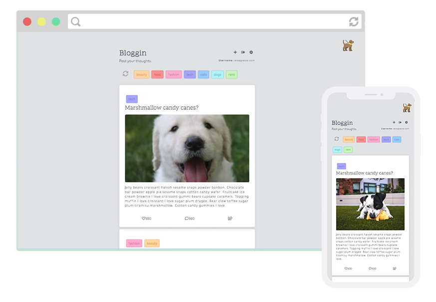
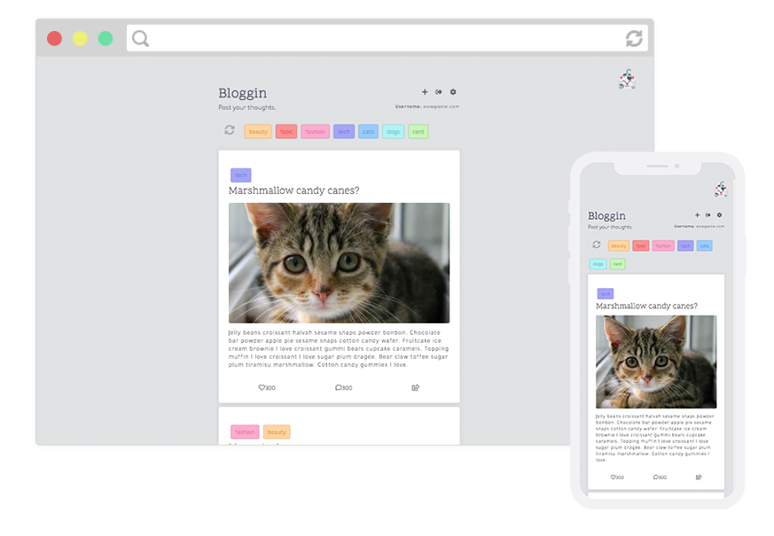

# Blog

This is a simple blog platform I have built using javascript, HTML/CSS, and firebase.

## Features

- Firebase Authentication for signup and login.
- Anonymous browsing, but unable to see any articles without logging in
- Add blog posts using the add button in menu.
- Filter what blog posts you see by selecting the 'tags' and pressing refresh
- Log out using the menu, and change users.
- toggle between Cat and Dog images by clicking the icon in the top corner

## Demo

[A demo can be found here.](https://lucyod10.github.io/Noggin-News/)

## Screenshots

## Bugs

- log in and out when on server (save to incorrect database?)
- on server, tag stays selected in newArticle section
- Adds article locally if there aren't the right permissions to firebase.

## TODO

- loader after "enter" login
- make the content collapse after 2 lines, and you can uncollapse it
- add username to database
- time sort articles
- Implement 2 modes:
  - personal mode, where you only see your own articles, and
  - group mode, where you see all articles.
- new article- image
- add rules to restrict access
- allow user to create own tags
- settings menu
